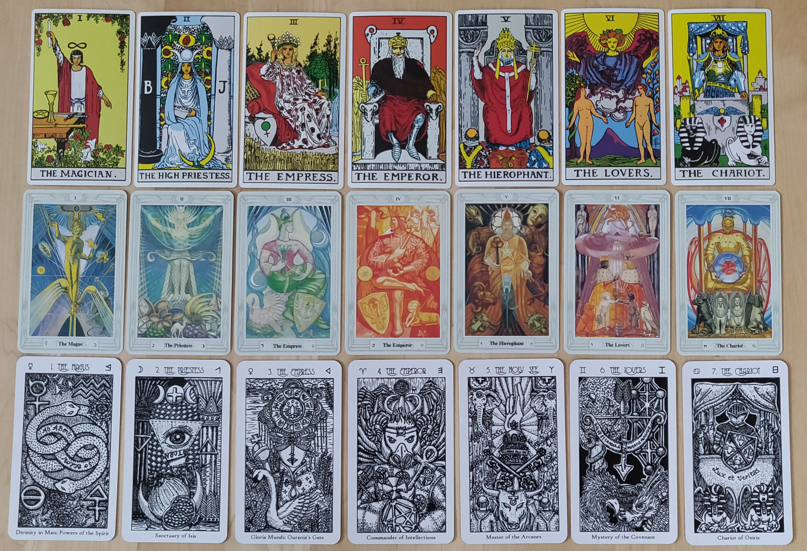

# Machine-readable alt-text-style descriptions for Rider–Waite–Smith tarot images
## Overview
Several open datasets provide structured text associated with Rider–Waite–Smith (RWS) tarot images, but there is no single canonical “alt text of all 78 cards” file that is both concise accessibility alt text and clearly tied to the 1909 illustrations. Instead, there are three practical categories:[^1][^2]

- JSON datasets of Waite’s own pictorial descriptions (long, book-style prose, but strongly image-linked).[^3]
- JSON or API datasets of card meanings (semantic, not visual description).[^4][^5]
- Modern image–caption datasets derived from public‑domain scans, in machine‑learning style language (short visual captions that behave very much like alt text).[^6][^7]

For an AI agent that needs “rich, image‑comprehendable textual descriptions” of the 78 original RWS images in a dictionary‑like format, the best available starting point is a combination of Waite‑text JSON and a modern captioned image dataset.
## Waite-text JSON with narrative image descriptions
### tarot.json Waite descriptions
A GitHub gist `tarot.json` encodes the 78 cards as a JSON array, each with fields including `name`, `suite`, `image` (path to RWS image), `description`, and `interpretation`. The `description` field is taken directly from A. E. Waite’s *The Pictorial Key to the Tarot* and narrates the visual content of each card in full sentences rather than only divinatory meanings.[^3]

Examples:

- The Fool: describes “a young man in gorgeous vestments” at “the brink of a precipice,” with a bounding dog, a rose, wand, and embroidered wallet, plus the sun behind him and the edge with “no terror.”[^3]
- The Magician: describes the youth in magician’s robes with the infinity symbol, serpent girdle, wand raised to heaven, hand pointing to earth, and the four suit‑symbols on the table, as well as roses and lilies below.[^3]

These descriptions are rich, scene‑level image narratives that an LLM can use as text‑only stand‑ins for the original art.
### Format suitability
- **Structure:** A single JSON object with a top‑level `tarot` array; each card entry has string fields for name, suit, image path, and textual description.[^3]
- **Semantics:** `description` is explicitly about the pictured scene (objects, posture, background) rather than only keywords like “hope” or “betrayal,” making it appropriate to repurpose as alt‑text‑like content for AI comprehension.[^3]
### Licensing considerations
The gist itself does not state a license inline, but the text is a reuse of Waite’s 1911 *Pictorial Key*, which is public domain in the US and UK; the RWS images are also public domain in those jurisdictions. In practice this JSON can typically be used freely for projects, but any integration into a commercial app should still undergo its own legal review.[^8][^9]
## Classic tarot APIs and JSON datasets (meanings, not visuals)
A number of open tarot APIs expose JSON representing the 78 cards, but most focus on meanings rather than describing the pictures.
### ekelen/tarot-api
The `ekelen/tarot-api` project implements a REST API for the RWS deck and allows clients to fetch the card data as JSON. The data is “parsed from A. E. Waite’s *The Pictorial Key to the Tarot*” and the README explicitly says that one can “just grab the JSON file that serves as the data source and use it.”[^5][^2]

The documented fields support card names, short identifiers, and meanings; search endpoints filter by upright or reversed meanings. However, the documentation emphasizes divinatory meanings and text search, not dedicated image descriptions, so the internal JSON is optimized as a meanings database rather than a pure visual alt‑text list.[^2][^5]
### Other meaning‑centric APIs
Other projects such as `Dajeki/tarot-api` and `LindseyB/tarot-api` define JSON or HTTP endpoints with fields for upright and reversed meanings, suit, rank, element, signs, etc., but again primarily as semantic interpretations, not as descriptions of the card artwork. These are valuable to merge into an ontology for an AI tarot system, but they do not themselves satisfy the requirement of per‑card visual alt text.[^4][^10]
## JSON datasets including RWS images and metadata
### metabismuth/tarot-json
The `metabismuth/tarot-json` repository is an MIT‑licensed tarot dataset with JSON and accompanying RWS card scans. It provides two JSON files—`tarot-images.json`, which includes references to the scan filenames, and `tarot.json`, which omits image references. The scans are fetched from a public mirror of the Rider–Waite–Colman Smith images, and the project notes that the RWS deck is public domain in the US but not in the EU.[^1]

This dataset is useful as a machine‑readable index of RWS images linked to card identities, but it does not itself contain rich textual descriptions or alt text fields; those would need to be added from another source (e.g., Waite descriptions or ML captions).
### Searge/tarot XML

RWS and Thoth Tarot comparison
The `Searge/tarot` repository is described simply as “The Rider‑Waite Tarot Deck,” built as a multilingual tarot reference using XML/XSLT and licensed under CC‑BY‑SA 4.0. The README does not spell out whether its XML entries include detailed image descriptions versus card meanings and localized names, and the code browser snippet does not expose the XML structure directly.[^11]
Given the license and maintenance activity, this project may hold structured descriptions, but confirming their suitability as alt text would require inspecting the XML files directly.
## Modern card-image caption datasets (alt-text-like captions)
### HyperAI / 1920 Raider Waite Tarot
HyperAI hosts a “1920 Raider Waite Tarot” dataset that contains images and “associated text descriptions of all 78 cards from the original Rider‑Waite Tarot Deck,” intended as a resource for exploring tarot art and training image generators. The archive structure includes a large ZIP file with images plus text, but the UI does not expose the internal caption format directly; downloading is required to see exact schemas.[^6][^12]

The dataset is framed as public‑domain Rider–Waite imagery, but its card does not prominently state a license; it positions the resource as educational and notes that contributors should be contacted if copyright issues arise.[^12]
### Hugging Face multimodalart/1920-raider-waite-tarot-public-domain-cleaned
A more directly usable alt‑text‑like source is the `multimodalart/1920-raider-waite-tarot-public-domain-cleaned` dataset on Hugging Face. It is explicitly described as “a cleaned up version of the multimodalart/1920-raider-waite-tarot-public-domain dataset, without the card borders and names,” and the README metadata sets the license to MIT.[^7][^13]

The dataset has exactly 78 rows and two fields per record:

- `image`: a 1040×1040 pixel card image (borderless, no printed title).[^7]
- `caption`: a short natural‑language description such as “a trtcrd of a woman blindfolded and bound, surrounded by swords stuck in the ground” (Eight of Swords) or “a trtcrd of a heart pierced by 3 swords, rainy clouds on the background” (Three of Swords).[^7]

These captions behave like concise alt text: they focus on immediate visual elements—figures, posture, objects, and basic background—without divinatory keywords. Taken as a list, they form a very compact, machine‑readable mapping from each cleaned RWS image to a caption string that an AI agent can treat as visual semantics.[^7]

Because the dataset is MIT‑licensed, both the images and captions can be freely used with attribution in open and commercial projects, subject to general MIT terms.[^13]
## How close existing resources are to “exactly what you want”
Relative to the requirement “a .json or other dictionary‑like file/list of rich AI‑comprehendable textual descriptions of all 78 original RWS images,” existing resources fall into three usefulness tiers:

1. **Closest in spirit: multimodalart captions** – 78 entries with `(image, caption)` pairs, each caption a clear visual description in a single sentence, licensed under MIT.[^7][^13]
2. **Richer but verbose: Waite JSON descriptions** – `tarot.json` with per‑card `description` fields that narrate the card’s imagery over several sentences or paragraphs, drawn from *Pictorial Key*.[^3][^8]
3. **Supporting structure: meanings and IDs** – tarot APIs and `metabismuth/tarot-json` provide card names, suits, meanings, image filenames, and metadata but do not themselves define visual alt text.[^1][^4][^5]

There does not appear to be a publicly indexed, ready‑made JSON that combines all three (Waite‑style descriptions, modern concise captions, and structural metadata) into a single dictionary keyed by card name or ID.
## Practical strategy to obtain what is needed
Given current public resources, the most straightforward path to the desired artifact is:

1. **Use multimodalart’s cleaned dataset as the visual‑alt‑text base.** Download `multimodalart/1920-raider-waite-tarot-public-domain-cleaned` from Hugging Face; each row already contains a high‑quality, borderless RWS image and a succinct ML‑style caption. These captions can be treated as modern alt text.[^7]
2. **Overlay Waite’s narrative descriptions for richer context.** Use the `tarot.json` gist to attach Waite’s `description` and `interpretation` fields to the same 78 card identities, giving the AI both a short caption and a long scene description per card.[^3]
3. **Optionally add structural metadata from tarot APIs.** Pull card order, arcana classification, suit, elemental and astrological correspondences, and meanings from `ekelen/tarot-api` or similar JSON datasets to build a full ontology scaffold for your agent.[^4][^5]
4. **Serialize into a single dictionary‑like JSON.** Define a schema such as:

```json
{
  "the_fool": {
    "name": "The Fool",
    "arcana": "major",
    "index": 0,
    "image_path": "RWS_Tarot_00_Fool.jpg",
    "alt_caption": "a trtcrd of a young man standing on the edge of a cliff, looking up at the sky, holding a white rose in one hand and a small bag on a stick in the other, with a white dog at his feet and the sun shining brightly",
    "waite_description": "With light step, as if earth and its trammels had little power to restrain him...",
    "upright_meanings": ["beginnings", "innocence", "spontaneity", "free spirit"],
    "reversed_meanings": ["recklessness", "being taken advantage of", "inconsideration"]
  },
  "magician": { /* ... */ }
}
```

5. **Respect jurisdictional copyright details for images.** RWS imagery is public domain in the US and UK, but particular scans, colorizations, or card backs can still be protected; datasets like multimodalart’s have already curated public‑domain‑compatible images but still deserve attribution in line with their MIT license.[^8][^13][^9]

Following this recipe yields precisely what an AI tarot/divination agent needs: a single, dictionary‑like resource where each of the 78 RWS cards has a machine‑readable key and both concise alt‑text‑style captions and long‑form visual descriptions.

---

## References

1. [GitHub - metabismuth/tarot-json: tarot dataset in json, and cards](https://github.com/metabismuth/tarot-json) - tarot dataset in json, and cards. Contribute to metabismuth/tarot-json development by creating an ac...

2. [Tarot API](https://tarotapi.dev) - REST API for card names, descriptions, and divinatory meanings according to AE Waite's Pictorial Key...

3. [tarot.json](https://gist.github.com/ajzeigert/32461d73c17cfd8fd475c0049db451f5) - tarot.json. GitHub Gist: instantly share code, notes, and snippets.

4. [GitHub - Dajeki/tarot-api: simple JSON API for tarot cards and pertinent esoteric information hosted on GitHub](https://github.com/Dajeki/tarot-api) - simple JSON API for tarot cards and pertinent esoteric information hosted on GitHub - Dajeki/tarot-a...

5. [ekelen/tarot-api: Simple REST API for the tarot cards of the ... - GitHub](https://github.com/ekelen/tarot-api) - You are welcome to just grab the JSON file that serves as the data source and use it for your own pr...

6. [1920 Raider Waite Tarot Tarot Card Image Dataset](https://hyper.ai/en/datasets/33623) - Build the Future of Artificial Intelligence

7. [multimodalart/1920-raider-waite-tarot-public-domain-cleaned · Datasets at Hugging Face](https://huggingface.co/datasets/multimodalart/1920-raider-waite-tarot-public-domain-cleaned) - We’re on a journey to advance and democratize artificial intelligence through open source and open s...

8. [Rider–Waite Tarot - Wikipedia](https://en.wikipedia.org/wiki/Rider%E2%80%93Waite_Tarot)

9. [Category:Rider-Waite tarot deck - Wikimedia Commons](https://commons.wikimedia.org/wiki/Category:Rider-Waite_tarot_deck)

10. [GitHub - LindseyB/tarot-api: A simple tarot API](https://github.com/LindseyB/tarot-api) - A simple tarot API. Contribute to LindseyB/tarot-api development by creating an account on GitHub.

11. [GitHub - Searge/tarot: The Rider-Waite Tarot Deck](https://github.com/Searge/tarot) - The Rider-Waite Tarot Deck. Contribute to Searge/tarot development by creating an account on GitHub.

12. [1920 Raider Waite Tarot 塔罗牌图像数据集| 数据集| HyperAI超神经](https://hyper.ai/cn/datasets/33623) - 学习、理解、实践，与社区一起构建人工智能的未来

13. [multimodalart/1920-raider-waite-tarot-public-domain](https://huggingface.co/datasets/multimodalart/1920-raider-waite-tarot-public-domain-cleaned/blame/main/README.md) - We’re on a journey to advance and democratize artificial intelligence through open source and open s...

